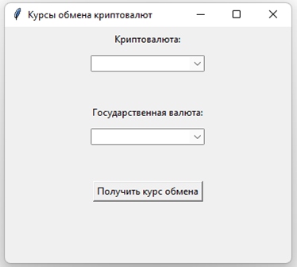

# Приложение для отслеживания курсов криптовалют

Графическое приложение для получения и отображения актуальных курсов криптовалют через публичное API CoinGecko.

## Содержание

- [Запуск приложения](#запуск-приложения)
- [Системные требования](#системные-требования)
- [Библиотеки](#библиотеки)
- [Функциональность](#функциональность)
- [Используемое API](#используемое-api)
- [Скриншот интерфейса](#скриншот-интерфейса)
- [Скачать](#скачать)

## Запуск приложения

1. Скачайте файл [kurs.py](#скачать)  
2. Запустите файл в приложении [PyCharm](https://www.jetbrains.com/pycharm/download/?section=windows)  

## Системные требования

- **Операционная система:** Windows 7/10/11  
- **Оперативная память:** 1 ГБ RAM  
- **Процессор:** Intel Core i3 или лучше  
- **Сетевое подключение:** требуется для запросов к API  
- **Python:** версия 3.12 или новее  

## Библиотеки

- Язык программирования: Python 3.12+  
- Графический интерфейс: Tkinter  
- HTTP-клиент: библиотека Requests  
- Формат данных: JSON  
- API: CoinGecko Public API  

## Функциональность

- Отслеживание курсов в реальном времени (**BTC, ETH, DOGE, TRUMP**)  
- Конвертация в государственные валюты (**USD, EUR, AED, CNY, RUB**)  
- Русскоязычный пользовательский интерфейс  
- Форматирование числовых значений  
- Обработка сетевых ошибок и таймаутов  
- Валидация пользовательского ввода  

## Используемое API

Приложение использует публичное API сервиса CoinGecko.  

## Скриншот интерфейса

## Скачать

- [kurs.py](kurs.py)
